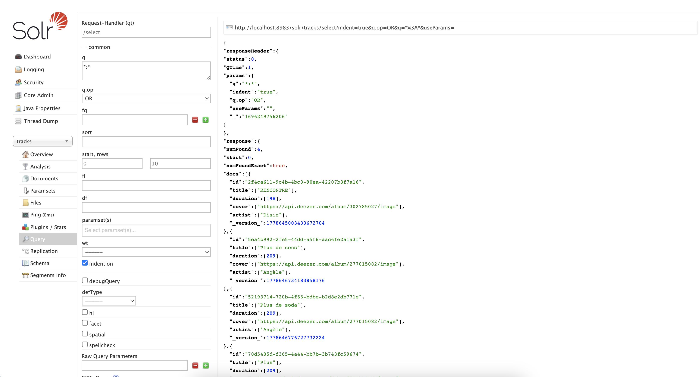

# TOS Index Inversé

## Introduction

**Pourquoi mettre en place un index inversé ?**

```sql
SELECT * FROM t WHERE description LIKE ‘%nicolas%’;
```

L'index inversé améliore drastiquement la recherche de chaînes de caractères dans des bases de données. Les requêtes traditionnelles, comme LIKE '%nicolas%', sont coûteuses en temps et ressources, car elles ne tirent pas parti des index classiques de la base de données. En revanche, l'indexation full-text divise le contenu en mots individuels et associe chaque mot à ses occurrences dans les documents. Une fois le contenu indexé, la recherche devient extrêmement rapide, offrant d'énormes gains de performance, surtout avec de grands volumes de données.

## Téléchargement de l'image Docker de Solr

```shell
docker run -p 8983:8983 -t solr
```

On peut voir notre Solr tourner à l'addresse :
`http://localhost:8983/solr/`

Il faut maintenant créer un core ou stocker nos données : 
```shell
docker exec -it --user=solr solr solr create_core -c your_core_name
```

> :warning: **Attention**: Parfois solr active par défaut les MultiValued, il faudra surement les désactiver

## Ajout des dépendances :

Ajout de ces deux packages nuget :

```xml
<ItemGroup>
    <PackageReference Include="SolrNet.Core" Version="1.1.1" />
    <PackageReference Include="SolrNet.Microsoft.DependencyInjection" Version="1.1.1" />
</ItemGroup>
```

## Container IOC

On enregistre notre core instance dans le container IOC de notre application :

```csharp
services.AddSolrNet<TrackSolrModel>("http://localhost:8983/solr/your_core_name");
services.AddScoped<TrackSolrRepository>();
```

## Couche repository

Notre couche repository nous permettra d'insérér des données dans notre core

```csharp
public class TrackSolrRepository
{
    private readonly ISolrOperations<TrackSolrModel?> _solr; // Inject solr instance
    
    public TrackSolrRepository(ISolrOperations<TrackSolrModel?> solr)
    {
        _solr = solr;
    }
}
```

Pour ajouter des données à notre core : 

```csharp
public async Task AddAsync(TrackSolrModel? track)
{        
    await _solr.AddAsync(track);
    await _solr.CommitAsync();
}
```

Dans notre interface on peut voir les données de notre core : 



## Requetage

Il y'a plusieurs moyens d'interoger notre index inversé. 

### Interface graphique

L'interface graphique nous permet de requeter notre index inversé avec plusieurs filtres : 
 - q : La query  principale
 - fq : Filtre permettant d'enregistrer des résultats en cache


### Code

On peut intéroger notre index inversé en utilisant le SDK de solr : 

```csharp
var solrResult = _solr.Query(new SolrQueryByField("name", $"name_str:*{"nicolas".Replace(' ', '*')}*"));
```


## Conclusion

Voilà pour la mise en place de Solr, ce tuto n'est qu'une 
façon de faire parmis tant d'autre. Il est déconseillé de reproduire ce tutoriel en l'absence d'un adulte responsable.


> :warning: **Attention**: L'utilisation de TOS créra une dette de 1 Kinder Bueno White
